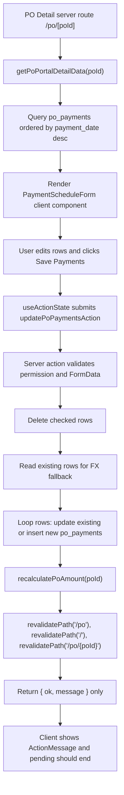

# PO Detail Payment Save Flow Audit

Audit date: 2026-05-26, Asia/Bangkok  
Scope: audit/report only. No payment implementation changes were made.

## Executive Summary

The PO Detail payment save flow is implemented as a client form using `useActionState()` with a server action. The database write path is straightforward and likely saves successfully, but the UI depends on server revalidation and remount behavior rather than an explicit returned saved row, local state update, or `router.refresh()`.

The most likely causes of the reported unstable behavior are:

| Finding | Risk | Summary |
| --- | --- | --- |
| No saved row payload or local state merge | High | The server action returns only `{ ok, message }`, not the inserted/updated payment rows, so the client cannot update the list immediately. |
| No explicit client refresh | High | `revalidatePath()` invalidates server cache, but the client form does not call `router.refresh()` or reconcile local state. |
| Controlled payment fields initialize from props once | High | `PaymentAmountFields` and `StyledPaymentSelect` keep internal state from initial props; existing rows with the same React key will not reliably reflect refreshed server props. |
| Sort order mismatch | Medium | Detail data queries payments by `payment_date desc`, but the edit form re-sorts ascending by `payment_date ?? due_date`; related sections use the raw descending order. |
| New-row keys are index-based | Medium | Unsaved rows use `new-${index}` where index depends on sorted payment count, so new blank rows remount/relabel after save or after date/order changes. |
| Global loading overlay listens to every submit | Medium | A normal form submit triggers the global loading overlay independently of the form pending state; it has a safety timeout, but can make a slow save feel stuck. |

The save action does catch errors and `useActionState` should eventually clear the `pending` flag, so an actual permanently stuck button is not obvious from the code. The stronger issue is that the save can succeed while the visible form stays in stale client-controlled state until a full browser refresh or a remount.

## Files Inspected

| File | Role |
| --- | --- |
| `src/app/po/[poId]/page.tsx` | PO Detail route, server component, fetches PO detail data and renders payment sections. |
| `src/app/po/po-forms.tsx` | Client components for payment schedule editing, payment amount fields, selects, action messages. |
| `src/app/po/actions.ts` | Server actions for adding/updating payments and revalidating PO views. |
| `src/lib/po-portal.ts` | Server-side Supabase read model for PO detail, including `po_payments` query. |
| `src/app/loading-controls.tsx` | Global loading overlay and per-button loading label behavior. |
| `src/app/layout.tsx` | Mounts `GlobalLoadingOverlay` globally. |
| `supabase/migrations/007_po_draft_cost_payment.sql` | Base `po_payments` table. |
| `supabase/migrations/011_po_payment_schedule.sql` | `payment_status`, `due_date`. |
| `supabase/migrations/015_po_payment_fx_amount.sql` | `exchange_rate`, `amount_thb`. |
| `supabase/migrations/047_po_payment_xero_status.sql` and `049_po_payment_xero_status_draft.sql` | `xero_status` values. |

## Current Save Flow Diagram



## Route and Component Map

| Concern | Location | Notes |
| --- | --- | --- |
| Route | `src/app/po/[poId]/page.tsx:604` | Async server component. |
| Dynamic mode | `src/app/po/[poId]/page.tsx:48` | `dynamic = "force-dynamic"`, so page itself is not statically cached. |
| Detail data fetch | `src/app/po/[poId]/page.tsx:621` | Calls `getPoPortalDetailData(decodeURIComponent(poId))`. |
| Payment section render | `src/app/po/[poId]/page.tsx:911-934` | Renders `PaymentScheduleForm` for super admin payment managers. |
| Payment approval list | `src/app/po/[poId]/page.tsx:942-1007` | Uses `data.payments` order directly. |
| Payment history list | `src/app/po/[poId]/page.tsx:1318-1353` | Uses `data.payments` order directly. |
| Editable payment form | `src/app/po/po-forms.tsx:2151-2378` | Main save UI. |
| Save server action | `src/app/po/actions.ts:1764-1927` | `updatePoPaymentsAction`. |
| Older add payment form/action | `src/app/po/po-forms.tsx:2081-2148`, `src/app/po/actions.ts:1713-1762` | Present but not used by current PO Detail payment section. |
| Payment read query | `src/lib/po-portal.ts:2977-3008` | Reads `po_payments`, ordered by `payment_date desc`. |

## Save Payment Flow Audit

| Step | Layer | Current behavior |
| --- | --- | --- |
| Button click | Client | Submit button at `po-forms.tsx:2370-2374` submits the form and disables based on `pending`. |
| Submit handler | Client/React | `useActionState(updatePoPaymentsAction, initialState)` at `po-forms.tsx:2164-2167`. No custom `onSubmit`, no `router.refresh()`. |
| Validation | Server | Permission check, required `poId`, numeric amount/FX checks, foreign currency rate check. |
| Delete rows | Server/DB | Deletes checked `deletePaymentId` rows before processing updates/inserts. |
| Existing row lookup | Server/DB | Reads `id,exchange_rate,amount_thb,currency` for existing IDs. |
| Save rows | Server/DB | Existing rows use `.update(row).eq("id", rawId).eq("po_id", poId)`; new rows use `.insert(row)`. |
| Returned payload | Server | Returns `success("Saved N payment rows")`; no saved payment row data. |
| Revalidation | Server | Calls `refreshPoViews(poId)`, which revalidates `/po`, `/`, and `/po/{encodedPoId}`. |
| Loading reset | Client | Relies on `useActionState` pending becoming false. No manual `finally`; no custom pending state exists. |
| Success handling | Client | `ActionMessage` displays returned message. No toast/highlight/new-row focus. |
| Data update | Client/server | No explicit local state merge and no explicit `router.refresh()`. |

## Confirmed Issues

### 1. Save action does not return saved rows

Risk: High

Evidence:

- New rows are inserted without `.select().single()` at `src/app/po/actions.ts:1912-1914`.
- Existing rows are updated without `.select()` at `src/app/po/actions.ts:1912-1914`.
- Action returns only `success("Saved N payment rows")` at `src/app/po/actions.ts:1923`.

Impact:

The client cannot know the new row ID, canonical normalized values, DB defaults, or final ordering after save. A newly saved row cannot appear as a stable saved row unless the server component refresh path happens and remounts the form with new props.

### 2. No explicit client refresh after successful save

Risk: High

Evidence:

- `PaymentScheduleForm` uses `useActionState` but does not import or call `useRouter()` / `router.refresh()` (`src/app/po/po-forms.tsx:2151-2378`).
- Server action calls `revalidatePath()` only (`src/app/po/actions.ts:416-421`, `1921-1923`).

Impact:

The implementation depends on Server Action revalidation behavior to update the current RSC tree. If that does not produce an immediate visible refresh, the user sees old props/state until manual browser refresh.

### 3. Controlled fields do not resync from refreshed props

Risk: High

Evidence:

- `PaymentAmountFields` initializes local state from props once: `useState(amount...)` and `useState(exchangeRate...)` at `src/app/po/po-forms.tsx:1991-1998`.
- `StyledPaymentSelect` initializes local state from `defaultValue` once at `src/app/po/po-forms.tsx:2063`.
- Existing row keys are stable as `existing-${payment.id}` at `src/app/po/po-forms.tsx:2256-2262`.

Impact:

When an existing payment row is updated and the same keyed component remains mounted, refreshed server props may not reset the controlled amount/rate/select state. This can make the form display stale or pre-save values even after the database save succeeds.

### 4. Payment order differs between edit form and read sections

Risk: Medium

Evidence:

- DB read orders by `payment_date desc`: `src/lib/po-portal.ts:2977-2981`.
- Edit form sorts ascending by `payment_date ?? due_date`: `src/app/po/po-forms.tsx:2168-2172`.
- Approval/history sections map `data.payments` directly: `src/app/po/[poId]/page.tsx:942-1001`, `1324-1349`.

Impact:

The same rows can appear in different order in the editable form versus approval/history blocks. After save, a row can move because a blank paid date is defaulted to today, or because a changed payment date changes the ascending sort.

### 5. New row identity is index-based

Risk: Medium

Evidence:

- Draft row keys are generated as `new-${index}` at `src/app/po/po-forms.tsx:2256-2258`.
- `rows` is `sortedPayments + blank rows`, so the draft index changes when saved rows are inserted/reordered at `src/app/po/po-forms.tsx:2173-2177`.

Impact:

Unsaved rows can remount or shift after save/revalidation. This can look like rows reset or reorder, especially when `extraRows` remains nonzero.

### 6. Global loading overlay can amplify the stuck-loading feeling

Risk: Medium

Evidence:

- `GlobalLoadingOverlay` is mounted globally at `src/app/layout.tsx:33-35`.
- It listens to all document `submit` events and calls `showSoon()` at `src/app/loading-controls.tsx:129-151`.
- It also listens to `LoadingLabel` custom start/stop events at `src/app/loading-controls.tsx:19-25`.

Impact:

Any payment save triggers both form pending UI and global overlay. If the server action is slow, if pending state does not flip visually, or if a route refresh/remount interaction is delayed, the global overlay makes the entire page feel stuck. It does have a 10-second safety timer, so this is more likely a perceived loading issue than a permanent lock.

### 7. Existing rows are saved sequentially

Risk: Low to Medium

Evidence:

- `updatePoPaymentsAction` loops rows and awaits each DB update/insert inside the loop at `src/app/po/actions.ts:1861-1918`.
- It then awaits `recalculatePoAmount(poId)` at `src/app/po/actions.ts:1921`.

Impact:

Large payment grids or slow Supabase responses can extend `pending` time. This does not directly explain stale UI, but it contributes to the loading complaint.

## Suspicious Code Snippets

```tsx
// src/app/po/po-forms.tsx:1991-1998
const [amountValue, setAmountValue] = useState(amount === null || amount === undefined ? "" : String(amount));
const [rateValue, setRateValue] = useState(
  exchangeRate === null || exchangeRate === undefined || savedExchangeRate <= 0
    ? normalizedCurrency === "THB"
      ? "1"
      : ""
    : String(exchangeRate),
);
```

Why suspicious: state is derived from props only once. Existing payment rows keep the same key after refresh, so values may not update from server data.

```tsx
// src/app/po/po-forms.tsx:2063
const [value, setValue] = useState(defaultValue);
```

Why suspicious: select state is also initialized once from props and can ignore refreshed `defaultValue`.

```tsx
// src/app/po/po-forms.tsx:2168-2172
const sortedPayments = [...payments].sort((a, b) =>
  String(a.payment_date ?? a.due_date ?? "").localeCompare(
    String(b.payment_date ?? b.due_date ?? ""),
  ),
);
```

Good: it uses `[...payments].sort(...)`, so it does not mutate props.  
Suspicious: this ascending sort differs from the server query and other page sections.

```tsx
// src/app/po/po-forms.tsx:2256-2258
const rowKey = payment?.id ? `existing-${payment.id}` : `new-${index}`;
```

Why suspicious: unsaved row keys depend on array index and can change when saved rows are inserted or sorted.

```ts
// src/app/po/actions.ts:1912-1914
const { error } = rawId
  ? await supabase.from("po_payments").update(row).eq("id", rawId).eq("po_id", poId)
  : await supabase.from("po_payments").insert(row);
```

Why suspicious: no `.select()` means the action does not return IDs or canonical values for immediate UI reconciliation.

## Loading State Findings

| Check | Finding |
| --- | --- |
| `setIsSaving(false)` in finally | Not applicable; no custom `isSaving` state exists. |
| `useTransition` pending | Not used. |
| Button disabled | Disabled by `useActionState` `pending`; should reset when action resolves. |
| Submit promise awaited | React handles action submission through `useActionState`; server code awaits DB writes. |
| Errors caught/surfaced | Server action catches most errors and returns an error message. Redirect errors are not specially handled in this action, but normal errors are surfaced. |
| Silent throw risk | Low; DB errors become `initialError(message)`. |
| `router.refresh()` blocking | Not used. |
| Infinite render loop | No obvious loop in payment save path. |
| Effects resubmitting/sorting | No useEffect in `PaymentScheduleForm`; child field state is the concern. |
| Global overlay stuck | Overlay has a 10s safety timeout, but all submits trigger it. |

## Data Refresh Findings

| Question | Answer |
| --- | --- |
| Does save return newly saved row? | No. |
| Does client update local payment state after save? | No. |
| Does client call `router.refresh()` after success? | No. |
| Does server action call `revalidatePath()`? | Yes, `/po`, `/`, and `/po/{poId}`. |
| Is detail page force dynamic? | Yes, `dynamic = "force-dynamic"`. |
| Is Supabase query cached? | Supabase client queries are not Next `fetch` cache calls; page is dynamic. |
| Does list come from server props while form is client-side? | Yes. |
| Possible display-column mismatch? | Low for current query; it selects `exchange_rate`, `amount_thb`, `xero_status`, and fallback selects omit newer columns only on schema errors. |

## Sorting / Reset Findings

| Area | Finding |
| --- | --- |
| In-place sort on props/state | Payment form correctly uses `[...payments].sort(...)`, so no direct mutation issue there. |
| Defined sort rule | Edit form sorts ascending by `payment_date ?? due_date`; server read and other sections use descending `payment_date`. |
| Missing dates | Planned rows often have null `payment_date`, so empty string sorts before dated rows in the edit form. |
| New rows | Paid new rows without date get `today`; planned rows can keep null payment date and due date, affecting position. |
| Optimistic row | No optimistic row model exists. |
| Temporary IDs | New rows use `new-${index}` only until a server refresh shows DB ID. |
| Form reset | No explicit reset on success; draft blank rows remain because `extraRows` state remains. |
| Expanded row state | No expanded/collapsed payment row state found in the edit form. |

## Payment Row Identity Findings

| Check | Finding |
| --- | --- |
| Existing row key | `key={existing-${payment.id}}`, stable. |
| New row key | `key={new-${index}}`, unstable across row count/order changes. |
| ID exists immediately after save | Not on client; action does not return inserted row ID. |
| Upsert returns ID | No upsert is used and no `.select()` is used. |
| Edit mode depends on index | Row labels and default `payment_${index + 1}` depend on index; row identity for existing rows uses ID. |
| Expanded/collapsed depends on index | Not found in payment edit form. |

## Database Save Audit

| Concern | Finding |
| --- | --- |
| Table | `po_payments`. |
| Insert/update/upsert | Uses insert for new rows and update for existing rows; no upsert. |
| Conflict target | None. |
| Returned rows | None. |
| Error handling | Throws DB error message, caught by action and returned as `PoActionState`. |
| Numeric handling | Empty amount becomes `0`; foreign currency requires FX > 1. |
| Date handling | Paid rows default blank `payment_date` to today; planned rows get null payment date and optional due date. |
| Null/empty handling | Empty due/reference/note/paid_by become null; currency defaults to `"THB"`. |
| Empty response body | Save can succeed with no returned row body by design. |
| Partial-save behavior | Possible: deletes and earlier row writes happen before a later row error. No transaction wraps the full save. |

## Cache / Revalidation Audit

| Check | Finding |
| --- | --- |
| Server-side queries | Yes, PO detail data is fetched server-side in `getPoPortalDetailData`. |
| Next caching | Page is force dynamic. `revalidatePath()` still used. |
| Exact path revalidation | Uses encoded path `/po/${encodeURIComponent(poId)}`; route is `/po/[poId]`, so this is likely correct for literal PO IDs. |
| Client refresh | Not used. |
| Need both revalidation and local update? | For immediate stable UX, yes: either return rows and merge local state, or call `router.refresh()` after success and make child fields sync to props. |

## Race Condition Audit

| Race | Risk |
| --- | --- |
| Multiple Save clicks | Low; submit button disables while `pending`, but double-click before pending flips is theoretically possible. |
| Save and refresh running together | Medium; revalidation can update server props while controlled child field state remains local. |
| Reset before DB response | Low; no explicit reset before response. |
| Optimistic update then refresh override | None; no optimistic update. |
| Stale closures | Low; form data is read by browser submit, not closure state. |
| Effect on payments array | Low; no payment form effect. |
| Partial DB writes | Medium; deletes/writes are not transactional, so a later validation/DB error can leave earlier changes committed. |

## UX Audit

Current behavior:

- Button shows `Saving...` through `LoadingLabel`.
- A success/error inline message appears through `ActionMessage`.
- There is no toast.
- There is no saved-row highlight.
- The form does not close/reset on success.
- New blank rows remain after save because `extraRows` remains at least 1.
- Saved values are not locally merged into the form after success.
- Payment order can differ between the edit grid, approval requests, and payment history.

Expected behavior gap:

The user expects "save complete" to mean the row is now visibly saved with a stable ID/order. The current code only confirms that the server action returned `ok`; visible row reconciliation is indirect.

## Recommended Fix Plan

### Critical / High Priority

1. Make `updatePoPaymentsAction` return the canonical saved payment rows for the PO, or at least the inserted/updated rows with IDs.
2. After successful save, update the client payment list immediately or call `router.refresh()` in a client wrapper.
3. Make `PaymentAmountFields` and `StyledPaymentSelect` resync when their row ID/default props change, or convert the whole payment grid to a controlled row-state model keyed by payment ID/client temp ID.
4. Use stable client-generated IDs for unsaved rows instead of `new-${index}`.

### Medium Priority

5. Define one payment sort rule and use it consistently in `getPoPortalDetailData`, `PaymentScheduleForm`, approval rows, and payment history.
6. Add a deterministic tie-breaker such as `created_at` or `id` for rows with same/null dates.
7. Consider wrapping delete/update/insert/recalculate in one database RPC or transaction-like server operation to avoid partial saves.
8. Reset `extraRows` only after confirmed success, and preserve form data on error.

### UX Polish

9. Show a clear "Saved" confirmation state and optionally highlight changed/new rows.
10. If `router.refresh()` is used, keep the button pending only for the action and do not let the global overlay imply a page navigation is stuck.
11. Add a small "Sort: due/paid date ascending" label if payment rows intentionally move after save.

## Exact Next-Step Checklist

- [ ] Decide whether to fix via returned saved-row payload/local state or via `router.refresh()` plus prop-sync fixes.
- [ ] Add a stable `clientKey` for draft rows.
- [ ] Update payment input/select components so refreshed props update controlled state when the payment row changes.
- [ ] Return selected columns after insert/update, or re-query `po_payments` after save and return the full ordered list.
- [ ] Add one shared payment sorting function with explicit null-date and tie-break behavior.
- [ ] Ensure success resets only the intended blank draft rows.
- [ ] Preserve edited values when the server action returns an error.
- [ ] Add a small regression test or manual QA script: create new payment, edit existing payment, save planned row, save paid row, invalid FX error, delete row.
- [ ] Verify no manual browser refresh is needed after save.
