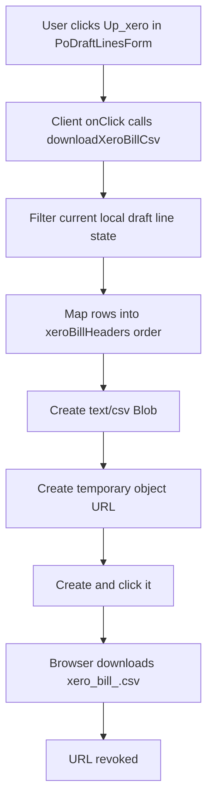

# up_xero Button / Xero Upload Flow Audit

Date: 2026-05-26  
Scope: audit/report only. No implementation changes made.

## Executive Summary

The `Up_xero` button is not a direct Xero upload. It is a client-side CSV download button inside the PO Detail draft-line editor. It exports the current editable PO line state into a file named `xero_bill_<poReference>.csv`.

There are two separate Xero-related concepts in the current app:

| Area | Current behavior | Risk |
|---|---|---|
| `Up_xero` button | Generates a local CSV from draft PO line rows. No server action, no DB write, no Xero API call. | High: label implies upload, but no upload or status tracking occurs. |
| Payment `xero_status` | Manual select in Payment Schedule with `pending`, `draft`, `uploaded`; saved only when Save Payments is clicked. | High: users can mark uploaded/draft without an actual successful export or Xero upload. |

The CSV is also incomplete for Xero bill import: required Xero columns such as invoice number, invoice date, due date, account code, tax type, and tracking/department are emitted blank. Department/tracking is not mapped in Xero's expected `TrackingName` / `TrackingOption` column pairs.

## Files Inspected

| File | Purpose |
|---|---|
| `src/app/po/po-forms.tsx` | Renders `Up_xero`, builds CSV, renders payment Xero status select. |
| `src/app/po/[poId]/page.tsx` | PO Detail route; controls whether draft-line/payment sections render. |
| `src/app/po/actions.ts` | Server actions for draft lines and payment rows; saves `xero_status`. |
| `src/lib/access-control.ts` | Role/capability checks for PO edit/payment permissions. |
| `src/lib/role-nav.ts` | Page access for admin/control-tower and payment workbench roles. |
| `src/lib/po-portal.ts` | PO Detail data load, including `po_payments.xero_status`. |
| `supabase/migrations/007_po_draft_cost_payment.sql` | Creates `po_payments`. |
| `supabase/migrations/011_po_payment_schedule.sql` | Adds `payment_status` and `due_date`. |
| `supabase/migrations/015_po_payment_fx_amount.sql` | Adds `exchange_rate` and `amount_thb`. |
| `supabase/migrations/047_po_payment_xero_status.sql` | Adds `xero_status`; comments say it is an internal reminder flag only. |
| `supabase/migrations/049_po_payment_xero_status_draft.sql` | Adds `draft` to allowed `xero_status` values. |

## Button Location

| Item | Finding |
|---|---|
| Component | `PoDraftLinesForm` in `src/app/po/po-forms.tsx`. |
| Button code | `Up_xero` button at `src/app/po/po-forms.tsx:1752`. |
| Helper | `downloadXeroBillCsv` at `src/app/po/po-forms.tsx:384`. |
| CSV headers | `xeroBillHeaders` at `src/app/po/po-forms.tsx:330`. |
| Page route | PO Detail: `src/app/po/[poId]/page.tsx`. |
| Visible section | `Draft Line Details`, rendered only when `data.source === "supabase" && allowEditPo` around `src/app/po/[poId]/page.tsx:1290`. |
| User-facing label | `Up_xero`. |
| Current visible roles | Effectively super admin only, because page sets `allowEditPo = canEditPo(email) && currentUser.role === "super_admin"`. |

The button does not appear in the Dashboard, Action List, Payment Requests pages, or Incoming ETA table. It is not attached to the payment approval flow.

## Current Click Flow

There is no server action, API route, Supabase update, Xero API call, toast, `router.refresh()`, or revalidation in this click flow.

## What `up_xero` Actually Means

Current behavior is closest to:

**A. Exports a Xero CSV file**

It does not:

- Upload directly to Xero API.
- Create a Xero draft bill.
- Mark a payment as uploaded to Xero.
- Update `xero_status`.
- Store Xero bill IDs, references, uploaded timestamps, errors, or uploaded-by user.

## Current Data Mapping Table

The CSV is built from `DraftLineItem[]` local React state in `PoDraftLinesForm`, not directly from the database at click time. If the user edited line values in the form but has not clicked Save Draft Details, the export uses those unsaved local edits.

| Xero CSV column | Current value | Source | Notes |
|---|---|---|---|
| `*ContactName` | `supplierName` | `PoDraftLinesForm` prop from PO detail data | No validation against Xero contact names. |
| `EmailAddress` | blank | hardcoded | Not populated. |
| `POAddressLine1-4`, `POCity`, `PORegion`, `POPostalCode`, `POCountry` | blank | hardcoded | Not populated. |
| `*InvoiceNumber` | blank | hardcoded | Required Xero column emitted blank. |
| `*InvoiceDate` | blank | hardcoded | Required Xero column emitted blank. |
| `*DueDate` | blank | hardcoded | Required Xero column emitted blank. |
| `Total` | blank | hardcoded | Not populated. |
| `InventoryItemCode` | `line.sku` | local draft line state | Uses SKU as item code. |
| `Description` | product title / variant / full name / SKU | `xeroDescription(line)` | Reasonable fallback. |
| `*Quantity` | `line.qty` | local draft line state | No formatting guard beyond JS value. |
| `*UnitAmount` | `line.unitPrice` | local draft line state | May include VAT/FX adjustments applied in UI. |
| `*AccountCode` | blank | hardcoded | Required Xero column emitted blank. |
| `*TaxType` | blank | hardcoded | Required Xero column emitted blank. |
| `TaxAmount` | blank | hardcoded | Not populated. |
| `TrackingName1` | blank | hardcoded | Department/tracking not mapped. |
| `TrackingOption1` | blank | hardcoded | Department/tracking option not mapped. |
| `TrackingName2` | blank | hardcoded | Not mapped. |
| `TrackingOption2` | blank | hardcoded | Not mapped. |
| `Currency` | `THB` | hardcoded `exportCurrency` | Ignores original PO/supplier currency after export. |

## Xero Status Lifecycle

`xero_status` is stored on `po_payments`, not on PO line exports.

| Status | Where defined | Meaning in current app |
|---|---|---|
| `pending` | Migration 047 and action default | Initial/internal reminder state. |
| `draft` | Migration 049 | Manual marker for draft bill state. |
| `uploaded` | Migration 047 | Manual marker for uploaded state. |

Important findings:

- Migration 047 explicitly says this is an internal reminder flag only and does not integrate with Xero.
- `addPoPaymentAction` inserts new payment rows with `xero_status: "pending"`.
- `PaymentScheduleForm` renders a manual `Xero` select with `pending`, `draft`, and `uploaded`.
- `updatePoPaymentsAction` saves whatever selected status passes `xeroStatus(...)`.
- No code sets `xero_status` after `Up_xero` succeeds because `Up_xero` does not call the server.
- No code sets `xero_status` to error on failure because no failure state is captured.

## Permission Findings

| Capability | Current behavior |
---|---|
| See `Up_xero` | Super admin only via `allowEditPo` and `Draft Line Details` section. |
| Use `Up_xero` | Client-side only. If visible, no server permission applies because no server call occurs. |
| Edit payment `xero_status` | Super admin only via `allowManagePayments`. |
| Server enforcement for payment status changes | `updatePoPaymentsAction` requires payment management permission. |
| Accounting users | Can access payment workbench in nav, but this PO Detail payment edit section is not available unless admin/control-tower flow allows it. |
| Warehouse/read-only/dashboard-only users | Should not see `Up_xero` or payment Xero controls under current gating. |

The current `Up_xero` permission is UI-only because the action is local file generation. If a future implementation uploads or marks status, it must add server-side permission enforcement.

## Duplicate / Race Condition Findings

| Scenario | Current behavior | Risk |
|---|---|---|
| Double-click `Up_xero` | Downloads duplicate CSVs. No disabled/loading state. | Medium. |
| Same PO exported twice | Allowed without warning. | Medium. |
| Same invoice/bill reference generated twice | No invoice number is generated, so no idempotent reference exists. | High if later uploaded manually. |
| Multiple users export same PO | No tracking or lock. | Medium. |
| Mark payment `uploaded` twice | Manual status can be saved repeatedly. | Medium. |
| Xero draft bill duplicate prevention | None. No Xero bill ID/reference stored. | High for future direct integration. |

## Loading / UI Refresh Findings

`Up_xero` has no loading UI. It creates and downloads a CSV synchronously. The button remains enabled throughout.

Payment `xero_status` changes rely on the payment schedule save flow. After the recent payment-save fix, that action returns canonical payment rows and refreshes the route, so manual `xero_status` changes should update visibly after Save Payments. However, the status remains manually controlled and not tied to successful export/upload.

## Department / Tracking Findings

Department/tracking is not implemented.

Xero CSV headers include:

- `TrackingName1`
- `TrackingOption1`
- `TrackingName2`
- `TrackingOption2`

But all four values are hardcoded blank. This means Xero Department will not appear after import because the CSV does not provide the tracking category name or option in Xero's expected column structure.

There is no mapping table for:

- Xero tracking category name.
- Xero department/tracking option.
- Internal supplier/product/PO tag to Xero department.
- Account code by SKU/category/supplier.

## Bugs or Suspicious Logic

| Risk | Issue | Evidence | Impact |
|---|---|---|---|
| High | Button label implies upload but only downloads CSV | `Up_xero` calls `downloadXeroBillCsv`; no server/API/Xero call | Users may believe Xero is updated when it is not. |
| High | Required Xero columns are blank | `*InvoiceNumber`, `*InvoiceDate`, `*DueDate`, `*AccountCode`, `*TaxType` all blank | CSV may fail import or require manual editing. |
| High | Department/tracking not exported | Tracking columns blank | Known issue: Xero Department will not appear. |
| High | `xero_status` can be manually set to uploaded without proof | Payment select saves `uploaded` through `updatePoPaymentsAction` | DB can say uploaded when no upload/export happened. |
| Medium | No duplicate protection | No lock, idempotency key, Xero reference, or DB export record | Duplicate manual imports are easy. |
| Medium | CSV uses unsaved local draft state | Export reads `lines` React state, not committed DB data | Export can differ from saved PO detail. |
| Medium | Currency is hardcoded THB | `exportCurrency = "THB"` | Foreign supplier bills may export incorrectly. |
| Medium | No totals reconciliation | `Total` blank; no line sum check | Manual import may drift from PO/payment totals. |
| Medium | VAT mode is not reflected as Xero tax type | `*TaxType` blank even after VAT buttons | Tax treatment is ambiguous. |
| Low | No user feedback beyond browser download | No success/error message | User cannot tell whether the CSV matched expectations. |

## Error Handling Audit

| Failure case | Current behavior |
|---|---|
| CSV generation fails | No try/catch; browser console error likely; no user message. |
| Browser blocks download | No user message. |
| Xero API fails | Not applicable; no API call. |
| Supabase update fails | Not applicable to `Up_xero`. Payment status save shows action error. |
| Payment row missing | Not applicable to `Up_xero`; payment save handles DB errors. |
| PO missing | PO detail route handles `notFound`; export only exists if page loaded. |
| Supplier/contact missing | CSV contact may be blank or poor quality; no validation. |
| Account code missing | Always blank; no validation. |
| Department/tracking missing | Always blank; no validation. |
| Currency/FX missing | CSV ignores payment FX and hardcodes THB. |
| Amount zero/null | Rows are included if SKU/title exists or qty > 0, so zero-qty named rows can export. |
| User lacks permission | Hidden by page gating. No server action exists to enforce on click. |
| Double-click | Duplicate CSV downloads. |

## Database Consistency Audit

Current `po_payments` Xero-related storage:

| Column | Exists? | Notes |
|---|---|---|
| `xero_status` | Yes | `pending`, `draft`, `uploaded`. Manual/internal only. |
| `xero_uploaded_at` | No | Missing. |
| `xero_reference` | No | Missing. |
| `xero_bill_id` | No | Missing. |
| `xero_error` | No | Missing. |
| `uploaded_by` / `xero_uploaded_by` | No | Missing. |
| `updated_at` on `po_payments` | Not in migrations inspected | Current code attempts to select it with fallback, suggesting schema drift or anticipated column. |

The current schema cannot reliably distinguish:

- CSV generated but not imported.
- Draft bill created in Xero.
- Upload/import failed.
- Uploaded successfully.
- Already synced to Xero with a durable Xero bill ID.

## Recommended Fix Plan

### Critical Correctness Issues

1. Rename or replace `Up_xero` behavior so it no longer implies direct upload unless it truly uploads.
2. Decide the real workflow: CSV export, direct Xero draft bill API, or manual tracking only.
3. Prevent `xero_status = uploaded` from being manually saved unless tied to an actual successful export/import/upload event.
4. Add Department/tracking mapping in the format Xero expects: `TrackingName1 = <Xero tracking category name>`, `TrackingOption1 = <Xero option>`.
5. Populate required Xero CSV fields or block export with a clear validation error.

### High Priority UX / Data Clarity

1. Change button label to `Download Xero CSV` if CSV export remains the intended behavior.
2. Add an export preview or validation summary before download.
3. Show success/error feedback after CSV generation.
4. Add warnings for blank account code, tax type, invoice number/date/due date, contact, and tracking.
5. Separate PO line export status from payment `xero_status`; they represent different workflows.

### Medium Priority Reliability / Duplicate Prevention

1. Add a server-side `createXeroBillExportAction` that validates inputs and records an export event.
2. Store export metadata: generated file name, export timestamp, exported by, PO ID, checksum, status.
3. Add idempotent invoice/bill reference generation.
4. Disable the button while export is being prepared.
5. Add a unique or warning-level duplicate guard on PO/reference + export type.

### Nice-To-Have Polish

1. Add a small CSV download audit history on PO Detail.
2. Add a downloadable validation report for missing mappings.
3. Add mapping admin UI for account codes, tax types, and Xero tracking categories.
4. Add direct Xero API integration later only after CSV mapping is trusted.

## Exact Next-Step Checklist

- [ ] Confirm whether the business wants CSV export or direct Xero API upload.
- [ ] Rename `Up_xero` to match the chosen behavior.
- [ ] Define Xero bill identity: invoice number/reference format and duplicate rules.
- [ ] Add Xero mapping source for account code, tax type, department/tracking category, and tracking option.
- [ ] Add validation before export/upload.
- [ ] Add server-side permission enforcement for any future DB/Xero-changing action.
- [ ] Add export/upload status fields or an audit table.
- [ ] Stop allowing manual `uploaded` status without an associated successful event.
- [ ] Add clear UI loading, success, and error states.
- [ ] Test with a real Xero import template, especially Department/tracking columns.
